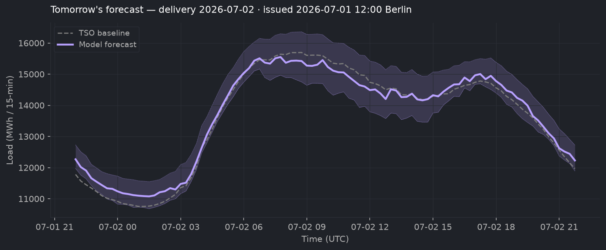
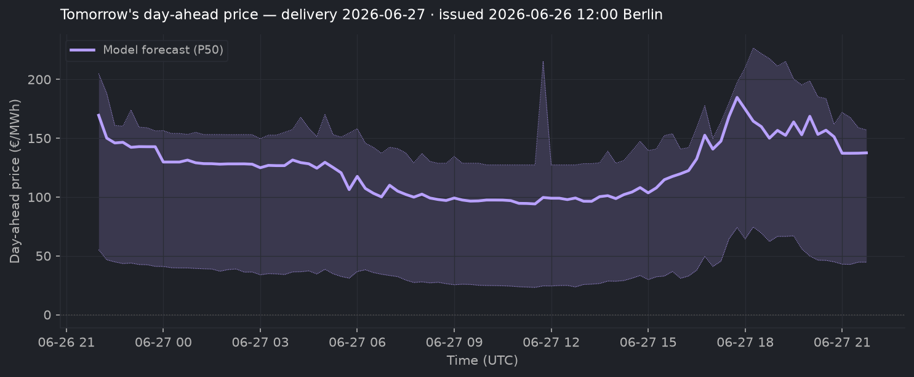
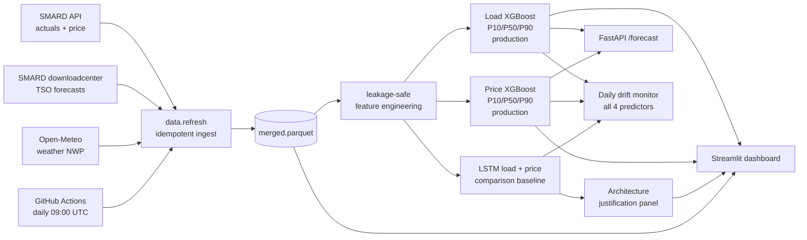

# German Day-Ahead Forecasting — Load and Price

[](https://github.com/connectashish028/german-day-ahead-forecast/actions/workflows/daily_refresh.yml)

> Production XGBoost quantile forecasters for the German day-ahead market. The **load model** beats the TSO's published forecast by **21 %** across a 14-month holdout. The **price model** captures **97 % of perfect-foresight battery P&L** on a 10 MW / 20 MWh battery — **+€65 k uplift over the 61-day Mar–Apr 2026 holdout** against a naive yesterday baseline. A seq2seq LSTM is retained as the live comparison baseline; both architectures are scored daily against realised actuals.

### → Live demo: **[german-load-forecast-v1.streamlit.app](https://german-load-forecast-v1.streamlit.app/)**

Switch between LOAD and PRICE views. Pick tomorrow or any past delivery day; see model forecast, realised values, TSO baseline (load) or naive yesterday baseline (price), per-day error, hour-of-day breakdown, and battery-dispatch P&L panel.


**Tomorrow's forecasts** — re-rendered every day from the live models:




## Why this project

Every European grid operator publishes a forecast of how much electricity the country will use the next day. In Germany this lives on the public [SMARD](https://www.smard.de/) portal as `fc_cons__grid_load`, and it's the **operational baseline** every utility, energy trader, and balancing-responsible party plans against. **Beating that real, public, operational forecast is the load model's job.**

The **day-ahead spot price** clears in the EPEX auction at 12:00 Berlin time; this is the signal that maps to € on a battery operator's, balancing-responsible party's, or intraday trader's P&L. **The price model's job is to predict that clearing price four hours before the gate closes**, accurately enough to dispatch a battery against it and capture as much of the theoretical-max arbitrage P&L as possible.

Most ML portfolio projects compare to a naive baseline and stop there. Beating real, public, *operational* numbers — and being able to point to live values — is a qualitatively different signal.

### Where the improvement comes from

#### Load model

Five iterations from the LSTM exploration phase, each adding one feature group. The findings transfer directly to the production XGBoost model — the lagged-TSO-error feature that drove the biggest LSTM lift (+13.9 pp) is also the production XGBoost's most important feature (14.9 % of total feature importance).

| Variant | Improvement vs TSO | Δ vs previous |
|---|---|---|
| Calendar only (hour / day-of-week / holiday) | +4.7 % | — |
| + Recent load history | +9.7 % | +5.0 pp |
| **+ Recent forecast error** (`actual − TSO`) | **+23.7 %** | **+13.9 pp** ⭐ |
| + TSO forecast as a decoder feature | +22.9 % | −0.8 pp |
| + Weather (4 NWP variables) | +24.2 % | +1.4 pp |

The single biggest lever is **showing the model the operator's recent errors**. On its own that one feature delivers more than half the project's total improvement. Adding the operator's forecast a second time as a decoder feature is roughly neutral — a deliberate negative result, since the model is already trained to predict the operator's *error*, the forecast itself doesn't carry extra signal.

#### Price model

The production price model is XGBoost. The LSTM v1→v4 iteration below is the history of *how I got there* — each iteration tackled a real failure mode of the LSTM, and the engineered features added during v4 (`vre_to_load_ratio`, `vre_percentile`) ended up benefiting the XGBoost ablation too. The architecture comparison (XGBoost vs LSTM v4 + M10 clip) on the same 61-day holdout: **XGBoost wins by 25 % average MAE and +1.9 pp dispatch P&L** — see the live dashboard's "Architecture justification" panel.

Four iterations, each tackling a specific failure mode:

| Version | Change | Result on the 61-day Mar–Apr 2026 holdout |
|---|---|---|
| v1 | Encoder = price + load + actual VRE; decoder = TSO load + weather | +18 % MAE vs naive, but **−65 % spread MAE** — median collapse |
| v2 | + `fc_gen__pv+wind` (TSO day-ahead VRE forecast) | +34 % MAE vs naive, spread gap closed to −23 % |
| v3 | + 30 % feature-dropout on `fc_gen` for graceful degradation | Full mode unchanged; degraded mode still beats naive by 19 % — model runs all day, not just after 12:30 |
| **v4** | + Engineered `vre_to_load_ratio` / `vre_percentile`; 3× weight on holidays + Sundays; 0.5× weight on 2022–2023 | **+36 % MAE vs naive on average, +60 % on the worst 10 % of days** |
| v4 + clip | Domain-rule shift on holiday × top-1 % VRE days, calibrated on 2024–2025 (the M10 patch) | May 1, 2026 (−500 €/MWh): MAE 81.8 → 72.8 |

**The headline trading metric: dispatch a 10 MW / 20 MWh battery against the XGBoost P50 forecast on each delivery day. The model captures 96.9 % of perfect-foresight P&L vs the naive baseline's 81.3 %** — a **+€65 k uplift over the 61-day holdout**. The dispatch sim is a deliberate price-taker abstraction — no state-of-charge tracking across days, no cycling-degradation cost, no market-impact penalty. Annualising the spring uplift or scaling linearly to a 100 MWh fleet would compound those abstractions; the honest read is **the 61-day uplift on a 20 MWh asset** with the larger numbers as a price-taker ceiling.

A surprise finding: P50-only dispatch out-performs P10-charge / P90-discharge dispatch by ~2 pp. **Battery dispatch is a ranking problem, not a calibration problem** — what matters is which slots are cheapest, not the absolute spread.

## Architecture



Every prediction respects an **issue-time cutoff of 12:00 Berlin time on the day before delivery** — the EPEX day-ahead market gate. A "corrupt-future" test scrambles every post-cutoff value in the source data and asserts the resulting features are byte-for-byte identical, so leakage isn't a thing we hope for, it's tested.

A **GitHub Action** runs the refresh + smoke-check + drift monitor + tomorrow-PNG renders every day at 09:00 UTC (11:00 CEST). The deployed Streamlit dashboard auto-redeploys on every commit, so the live forecasts are always current with no human intervention.

## Approach

- **Production architecture: XGBoost quantile regressors.** One model per quantile, native `reg:quantileerror`. 47 features for load, 50 for price (47 base + 3 engineered VRE features). Tested against a seq2seq LSTM baseline on the same data layer — LSTM ties on load average / wins worst-10 %, XGBoost wins on price across every metric. Both architectures still run daily for the live comparison trace.
- **Residual learning for load.** Predicts the operator's error — `actual − TSO_forecast` — and adds the correction. The operator already nails calendar + climatology; the model only learns the systematic remainder.
- **Raw target for price.** No public baseline exists; the model targets the raw clearing price. Naive yesterday-same-quarter-hour is the comparison.
- **Self-refreshing data layer.** SMARD and Open-Meteo expose authentication-free APIs. One CLI command rebuilds the parquet; a GitHub Action runs it daily at 09:00 UTC, smoke-checks both models, scores both architectures via the drift monitor, and commits the refreshed artifacts back.
- **Leakage tested.** A "corrupt-future" test scrambles every post-issue value in the source data and asserts the resulting features are byte-identical. 24/24 leakage tests pass.

## Repo layout

```
src/loadforecast/
  data/      # multi-source ingestion (SMARD API, SMARD downloadcenter, Open-Meteo)
  features/  # leakage-safe feature builders (calendar, lags, availability)
  models/    # Keras LSTMs + XGBoost wrappers, windowing, predict functions, extreme-tail clip
  backtest/  # rolling-origin evaluator + TSO + SARIMAX baselines
  serve/     # FastAPI inference service (load + price)
dashboards/  # Streamlit dashboard with LOAD / PRICE views + architecture-justification panel
tests/       # pytest — leakage tests, baseline harness, API smoke
scripts/     # training, refresh, render-PNG, smoke-check, drift monitor, P&L sim, M10 calibration
model_checkpoints/
  xgboost_load_v1/     # load model (production)
  xgboost_price_v1/    # price model (production)
  lstm_quantile_v1/    # LSTM load — comparison baseline
  price_quantile_v4/   # LSTM price — comparison baseline (with extreme_clip.json from M10 era)
backtest_results/      # holdout CSVs + battery-dispatch P&L + drift_log.csv (live trace)
```

## Quickstart

```bash
conda create -n loadforecast python=3.11 -y
conda activate loadforecast
pip install uv && uv pip install -e ".[dev]"

# 1. Verify install
pytest -q

# 2. Refresh the parquet from public APIs (~5 min)
python -m loadforecast.data.refresh --rebuild --start 2022-01-01

# 3. Train the production XGBoost models (~30 s each)
python scripts/train_xgboost_load.py
python scripts/train_xgboost_price.py

# 4. (Optional) Train the LSTM comparison baseline (~5 min each)
python scripts/train_lstm_quantile.py
python scripts/train_lstm_price_quantile.py
python scripts/calibrate_extreme_clip.py

# 5. Architecture comparison + battery P&L
python scripts/compare_lstm_vs_xgboost_load.py
python scripts/compare_lstm_vs_xgboost_price.py
python scripts/run_battery_pnl.py

# 6. Dashboard
streamlit run dashboards/app.py

# 7. Or hit the inference service
uvicorn loadforecast.serve.api:app
# POST localhost:8000/forecast {"delivery_date": "2026-05-08"}
# POST localhost:8000/forecast/price {"delivery_date": "2026-05-08"}
```

## Data sources

| Source | What | Auth |
|---|---|---|
| [SMARD](https://www.smard.de/) **API** (Bundesnetzagentur) | Total grid load, residual load, day-ahead clearing price, actual generation by source | none |
| **SMARD downloadcenter** (JSON) | TSO day-ahead load forecast, TSO day-ahead PV+wind forecast | none |
| [Open-Meteo](https://open-meteo.com/) | NWP (temperature, solar radiation, wind speed at 100 m, cloud cover; population-weighted across 6 German load centres) | none |

All data is licensed CC-BY 4.0.

## What's next

Active pivot toward production-grade trading-shop patterns: classical (SARIMAX) baseline + simple ensemble + risk-aware position sizing + trader-facing analytics panels. Tracked phase-by-phase via commits and PRs. The daily GitHub Action keeps both architectures' forecasts current; ongoing maintenance work is documented in commit messages.

## License

MIT. Data: CC-BY 4.0 (SMARD / Bundesnetzagentur, ENTSO-E).
